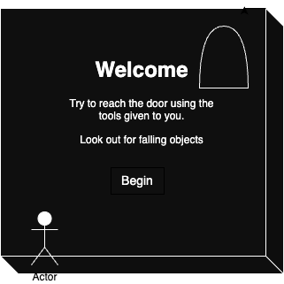
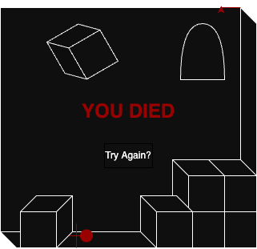
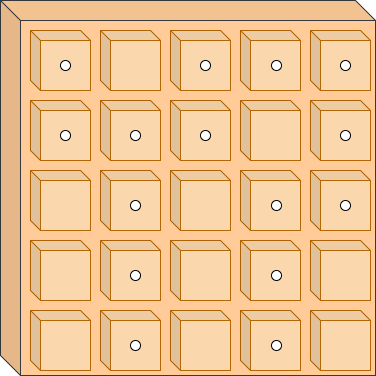
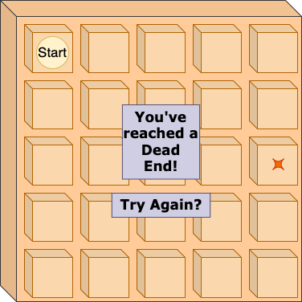

## Unit-One-Project
Unit 1 – Alina's Project ideas
# Main idea – A box stacking game
# Secondary idea – A memory game

## Main idea:
Stack to Escape

The world is made of black and white. A black background with white lines. There is a door that is hard to reach and there are boxes falling from above. The player must push and stack the boxes in order to escape. The player must also avoid falling boxes because the impact is deadly. Once the player reaches the doorway, the world becomes multi-colored, and the player sprite does a little dance.

# Technologies used:
HTML5
CSS
JavaScript

# User Story:
 As a player, I want the ability to...
*   start the game
*   move left and right
*   jump
*   avoid dangerous boxes
*   push boxes
*   lift boxes
*   stack boxes
*   drop boxes
*   climb boxes
*   reach mysterious, but promising doorway
*   win the game

# Wire frames:
# 
# 
# 
# 

# ERDs:
Player: {
*   X: (x location on the canvas)
*   Y: (y location on the canvas)
*   Height: (should be about the same as the boxes)
*   Width: (should be smaller than the boxes)
*   Color: white (red if dead, gray when game is won)
*   Alive: (a boolean that determines if game is in progress)
*   Render: (a method that displays the player on the screen)
*   }
Boxes: {
*   X: (x changeable locations for boxes to fall from) 
*   Y: (y changeable locations for boxes to fall from)
*   Height: (should be about the same as the player)
*   Width: (same as height)
*   Color: black
*   Alive: (a boolean that determines if game is in progress)
*   Render: (a method that displays the boxes are on the screen)
}
*   function – gameloop – holds the entire logic that runs the game
*   function – detectCrash – used to see if a box has fallen on the player
*   function – movementHandler – used to move the player around, should be attached to arrow or wasd keys, and spacebar
*   Function – detectTouch – used to help the player move boxes around

 
## Second Idea:

# Memory Labyrinth
# 

A simple puzzle game that starts with a grid of blank squares. The player must flip the squares to find the correct pathway to the MacGuffin. There are multiple pathways, but only one will lead to victory. If the player flips a square that does not contain a path piece, the squares flip back over, and the player must try again. If the player follows the wrong path to the dead end, the squares will flip back over, and the player must try again. When the player reaches the end of the labyrinth, the player wins a virtual MacGuffin!

# Technologies used:
HTML5
CSS
JavaScript

# User Story:
As a player, I want the ability to...
start the game
click on squares and have them react
explore the board by clicking on squares
explore the pathways of the game
find the correct pathway
win the game

# Wire Frames:
*   
(behind the scences overview)
*   
*   
*   
*   

# ERDs:
Pathway {
*   If (box === green) {
*   Pathway = correct
} else {
*   Pathway = wrong (restart)
}
}

*   function – gameloop – holds the entire logic that runs the game
*   function – offPath – used to see if a player has clicked a box off the path – delivers message and restarts game
*   function – deadEnd – used to see if a player has reached a dead end – delivers message and restarts game
*   function – gameWin – used to detect if the player has won

